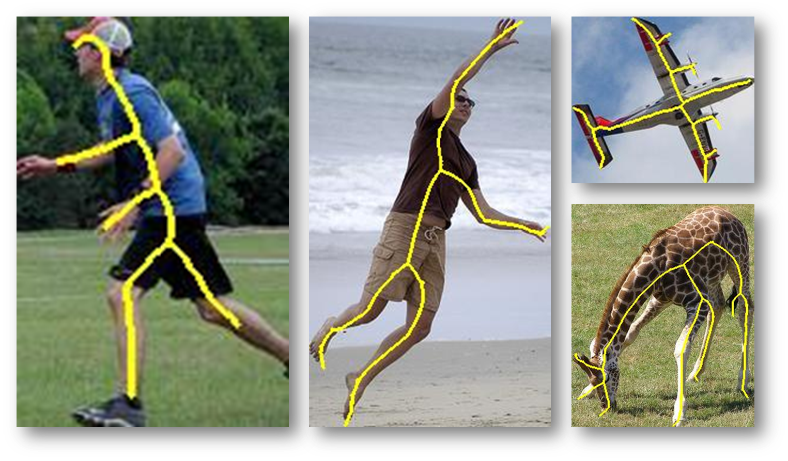

# SK-LARGE: Object Skeleton Dataset With 1K+ Instances
## About the dataset
This dataset SK-LARGE is used for evaluating the methods for skeleton extraction in natural images, which contents 1491 images selected from MS COCO [1], 746 for training and 745 for testing.

Each image in SK-LARGE has a corresponding skeleton map, which is extracted by using the approach introduced in [2]. Each groundtruth is represented by a .mat file, in which there are two fields:

edge: the contour(edge) map of the object. 1: contour; 0: non-contour.
symmetry: the skeleton(symmetry) map of the object. 1: skeleton; 0: non-skeleton.

#### Image showcase in SK-LARGE


## Skeleton Scale
The scale of a skeleton point is defined as its distance to the nearest edge point, which can be easily implemented by the Matlab function ``bwdist''.

A Matlab script `augmentation.m` is attached for data augmentation(flip, rotate and crop the origin images as well as groundtruth maps). 

[Here](https://github.com/zeakey/skeval) is the Code for skeleton-extraction performance evaluation. 

If you use this dataset, please cite our paper:

```latex
@inproceedings{Ref:Shen16,
  author     = {Wei Shen and Kai Zhao and Yuan Jiang and Yan Wang and Zhijiang Zhang and Xiang Bai},
  title      = {Object Skeleton Extraction in Natural Images by Fusing Scale-associated Deep Side Outputs},
  booktitle = {IEEE Conference on Computer Vision and Pattern Recognition (CVPR)},
  year       = {2016},
}
```

```latex
@article{shen2016deepskeleton,
  title={DeepSkeleton: Learning Multi-task Scale-associated Deep Side Outputs for Object Skeleton Extraction in Natural Images},
  author={Shen, Wei and Zhao, Kai and Jiang, Yuan and Wang, Yan and Bai, Xiang and Yuille, Alan},
  journal={arXiv preprint arXiv:1609.03659},
  year={2016}
}
```
For any questions about this dataset, please contact us by email: 

`<wei.shen@t.shu.edu.cn>` `<zeakey@outlook.com>`  `<y9387@outlook.com>`

[1] X. Chen, H. Fang, T. Lin, R. Vedantam, S. Gupta, P. Doll¡äar, and C. L. Zitnick. Microsoft COCO captions: Data collection and evaluation server. arXiv:1405.0312, 2015.

[2] Wei Shen, Xiang Bai, Xingwei Yang, Longin Jan Latecki. Skeleton Pruning as Trade-off between Skeleton Simplicity and Reconstruction Error. SCIENCE CHINA Information Sciences, 56(4): 1-14, 2013.


